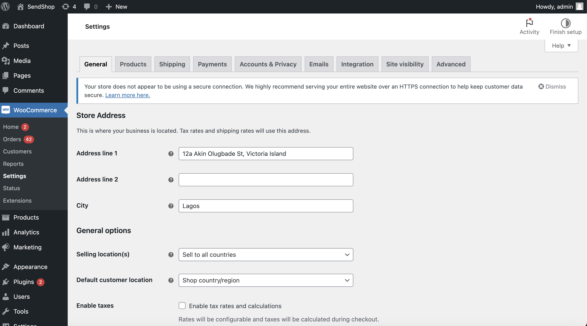
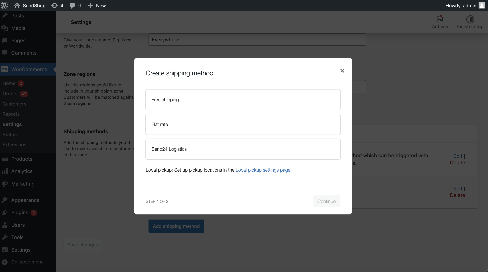
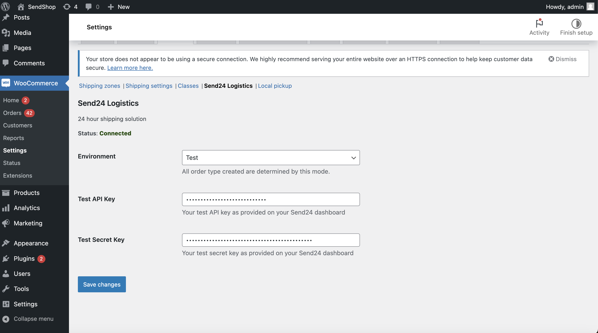
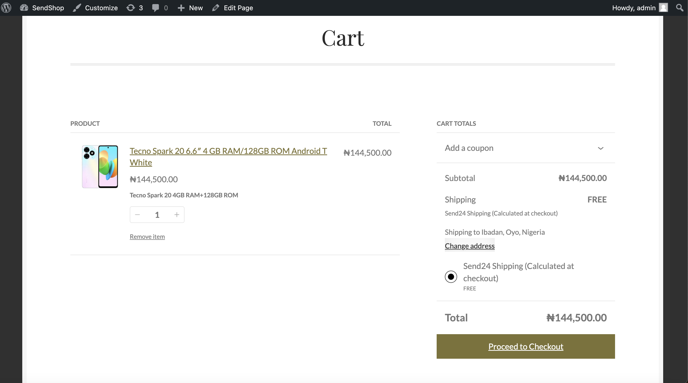
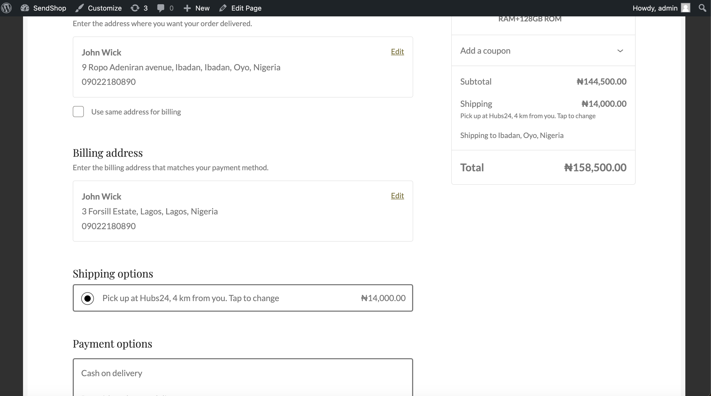
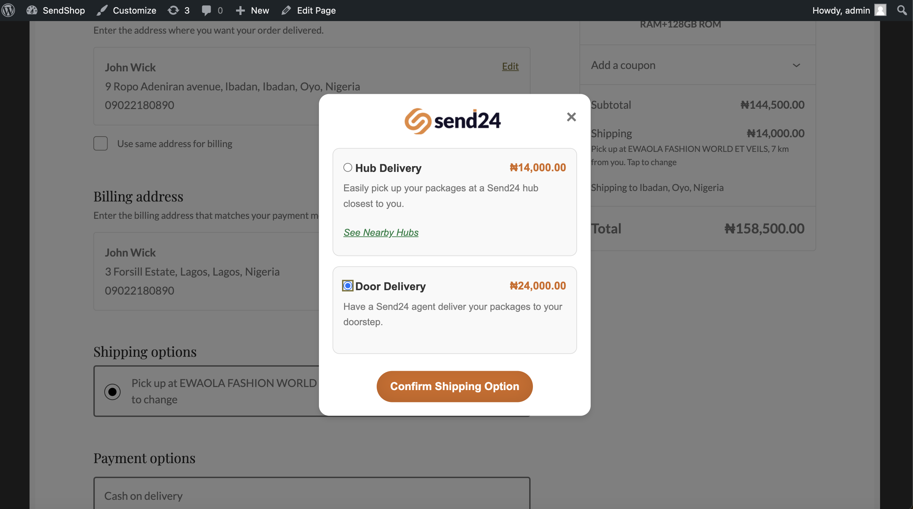
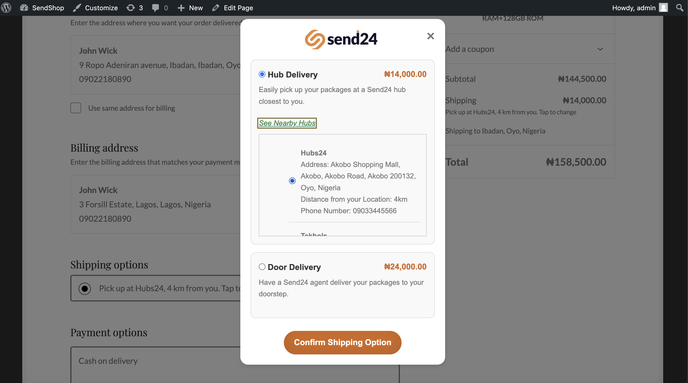

# Send24 Logistics Plugin for WooCommerce

The **Send24 Logistics Plugin** integrates Send24's delivery services into your WooCommerce store. It allows customers to choose between **Hub Delivery** and **Door Delivery** directly from the WooCommerce checkout page.

## Table of Contents

- [Send24 Logistics Plugin for WooCommerce](#send24-logistics-plugin-for-woocommerce)
  - [Table of Contents](#table-of-contents)
  - [Installation](#installation)
  - [Configuration](#configuration)
    - [API Keys](#api-keys)
    - [Mode (Test/Live)](#mode-testlive)
  - [Usage](#usage)
    - [Add the Shipping Method](#add-the-shipping-method)
  - [Settings Screenshots](#settings-screenshots)
    - [Set Up Delivery Options](#set-up-delivery-options)
  - [Order Creation Flow](#order-creation-flow)
  - [Order Screenshots](#order-screenshots)
  - [Debugging](#debugging)
  - [Changelog](#changelog)
  - [License](#license)

## Installation

1. Download the plugin from the GitHub repository.
2. Upload the plugin to your WooCommerce site via **Plugins > Add New** or extract the ZIP file and upload the `send24-shipping` folder to the `/wp-content/plugins/` directory.
3. Activate the plugin through the **Plugins** menu in WordPress.
4. Go to **WooCommerce > Settings > Shipping > Send24 Logistics** to configure your API keys and other settings.

## Configuration

### API Keys

- Navigate to **WooCommerce > Settings > Shipping > Send24 Logistics**.
- Enter your **Test API Key** and **Live API Key**, which you can obtain from your Send24 account.

### Mode (Test/Live)

- In the **Send24 Logistics** settings, you will find an option to switch between **Test Mode** and **Live Mode**.
- When **Test Mode** is enabled, the plugin will use the test API key for order creation, allowing you to test without creating real shipments.

## Usage

### Add the Shipping Method

1. Navigate to **WooCommerce > Settings > Shipping > Shipping Zones**.
2. Click on **Add Shipping Method** and select **Send24 Logistics** from the list of available shipping methods.
3. Configure shipping costs and zones where Send24 shipping is available.

## Settings Screenshots

1. **Store Address**:
   

2. **Shipping Method Setting**:
   

3. **API Keys Setting**:
   

### Set Up Delivery Options

- On the checkout page, the **Send24 Shipping** option will be available in the shipping methods section.
- When **Send24 Shipping** is selected, a modal will appear with two delivery options:

  1. **Hub Delivery**: Customers can select a hub near their destination address.
  2. **Door Delivery**: The package is delivered directly to the customer’s address.

- For **Hub Delivery**, customers will be presented with a list of nearby hubs based on the entered destination address and can select their preferred hub for pickup.

## Order Creation Flow

1. When the customer completes an order and selects **Send24 Shipping**, the plugin will trigger the Send24 order creation process via the **woocommerce_thankyou** hook.
2. The plugin collects order details such as:
   - Customer name
   - Shipping address
   - Chosen delivery method (Hub or Door)
   - Selected hub (if Hub Delivery is chosen)
   - Product details (size, fragility, label)
3. The order is then sent to the **Send24 API** using the appropriate API key (Test or Live, based on settings).
4. Upon successful creation, the order information is logged and visible in the **WooCommerce Orders** section.

## Order Screenshots

1. **Send24 Shipping Option at (Cart)**:
   

2. **Send24 Shipping Option (Checkout)**:
   

3. **Modal with Delivery Options**:
   

4. **Hub Selection for Hub Delivery**:
   

## Debugging

- **Enable Debug Logs**: Navigate to **WooCommerce > Settings > Send24 Logistics** and enable the "Enable Debug Logs" option.
- Logs will be saved to the `wp-content/debug.log` file. Logs will include API requests, responses, and any errors encountered.
- Common errors include network timeouts, incorrect API keys, or invalid shipping data.

## Changelog

**Version 1.0.0**:

- Initial release with Hub Delivery and Door Delivery options.
- Integration with Send24 API for shipping order creation.

## License

This plugin is open-source software licensed under the [MIT License](LICENSE).
